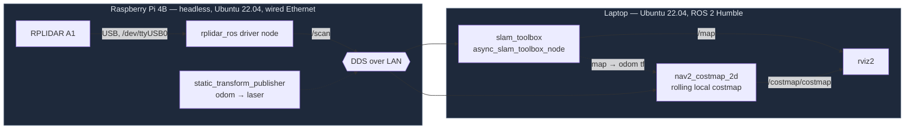

# RPLIDAR A1 + ROS 2 + SLAM on Raspberry Pi

A working, network-distributed 2D LiDAR SLAM pipeline: an RPLIDAR A1 spinning on a
headless Raspberry Pi 4B, streaming live scan data over Ethernet to a laptop running
`rviz2` and `slam_toolbox`. This repo is the debugging journal, configs, and helper
scripts from actually building it — every non-obvious failure is documented with
root cause and fix, not just the final happy-path steps.

This is part of a larger [design-credit SLAM rover project](docs/debugging-journey.md)
(camera + LiDAR fusion for autonomous navigation); this repo covers the LiDAR/SLAM
sensing leg of that project in isolation, since it was validated on a Pi + LiDAR
tabletop rig before being folded into the full rover.

> **Status as of this write-up:** SLAM mapping and a rolling local costmap are both
> working end-to-end, but motion tracking still relies on a hand-set *identity*
> transform (`odom` → `laser`) instead of real odometry — see
> [Current Status & Next Steps](#current-status--next-steps).

## Why this repo exists

Most of the time spent on this pipeline was not writing code — it was diagnosing why
a topic didn't show up, why a params file "wasn't taking effect," or why a map froze.
Those bugs tend to look identical to a beginner and to someone who's seen them
before, and the fix is usually a five-second command *once you know what to check*.
[`docs/debugging-journey.md`](docs/debugging-journey.md) preserves the actual
diagnostic path — including the false leads — so the next time one of these shows
up (on this project or any other ROS 2 setup), it's a lookup, not a re-derivation.

## System architecture



Both machines share one ROS 2 domain (`ROS_DOMAIN_ID=42`) over the same LAN, so DDS
discovery handles the Pi ↔ laptop communication automatically — no explicit
client/server networking code, just matching environment variables and an open
subnet.

## Hardware & software stack

| Component | Detail |
|---|---|
| Sensor | RPLIDAR A1 (2D spinning LiDAR, USB) |
| Edge device | Raspberry Pi 4B, headless, wired Ethernet on hostel LAN |
| Pi OS | Ubuntu Server 22.04 LTS (jammy) — re-flashed from stock Debian 13, see [Issue #1](docs/debugging-journey.md#1-osros-2-distro-mismatch-pis-original-debian-13-has-no-ros-2-support) |
| Dev laptop OS | Ubuntu 22.04 |
| ROS 2 distro | Humble (matched to Ubuntu 22.04 on both machines) |
| SLAM | `slam_toolbox` (`async_slam_toolbox_node`) |
| Local costmap | `nav2_costmap_2d` (lifecycle node, rolling window) |
| Visualization | `rviz2` |
| Odometry (planned) | [`rf2o_laser_odometry`](https://github.com/MAPIRlab/rf2o_laser_odometry) — not yet integrated, see Next Steps |

## Repo layout

```
.
├── README.md                    ← you are here
├── docs/
│   ├── debugging-journey.md     ← all 15 issues: what broke, root cause, fix, lesson
│   ├── lessons-learned.md       ← the cross-cutting lessons as a standalone checklist
│   └── NEXT_STEPS.md            ← rf2o_laser_odometry integration plan (unresolved gap)
├── config/
│   ├── my_slam_params.yaml      ← working slam_toolbox params (frame chain fixed)
│   └── local_costmap_params.yaml← working nav2_costmap_2d params (namespace fixed)
├── launch/
│   └── pi_lidar_bringup.launch.py ← example: driver + static odom→laser tf on the Pi
└── scripts/
    ├── find-pi-ip.sh             ← locate the Pi's IP after a DHCP reassignment
    ├── clear-ssh-known-host.sh   ← clear a stale SSH host key after a re-flash
    └── verify-slam-params.sh     ← confirm a params file actually loaded on the live node
```

## Quick start

These are the commands that matter once the environment is already set up correctly
(distro matched, packages installed, domain ID set). If any of these fail with
something unexpected, check [`docs/debugging-journey.md`](docs/debugging-journey.md)
first — there's a good chance the exact error is already diagnosed there.

**On the Pi** (LiDAR driver + a placeholder odometry transform):

```bash
source ~/.bashrc                      # picks up ROS_DOMAIN_ID — see Issue #7
ros2 launch launch/pi_lidar_bringup.launch.py
```

**On the laptop** (SLAM + local costmap + visualization):

```bash
# SLAM — run directly (not via `ros2 launch`) so a params-file error surfaces; see Issue #10
ros2 run slam_toolbox async_slam_toolbox_node --ros-args --params-file config/my_slam_params.yaml

# Local costmap (lifecycle node — must be explicitly activated; see Issue #14)
ros2 run nav2_costmap_2d nav2_costmap_2d --ros-args --params-file config/local_costmap_params.yaml
ros2 lifecycle set /costmap/costmap configure
ros2 lifecycle set /costmap/costmap activate

# Visualize
rviz2   # Fixed Frame: map (once slam_toolbox is up) — see Issue #8
```

**Sanity checks** worth running after any relaunch (this one habit would have saved
the most time across this whole debugging session — see Issue #10):

```bash
ros2 param get /slam_toolbox base_frame
ros2 topic hz /map
ros2 run tf2_ros tf2_echo odom laser
```

## Current status & next steps

Working: LiDAR streaming over the network, `slam_toolbox` building a real occupancy
grid map, a `nav2_costmap_2d` rolling local costmap receiving data. Both consumers
of the frame tree are up and publishing.

Not yet working: real motion tracking. Both SLAM and the costmap currently read
their "where is the sensor right now" from a **hand-set, permanently-identity**
`odom → laser` static transform — so as far as either node is concerned, the sensor
has never moved, even while it's physically being carried around. The map still
builds because `slam_toolbox` also does scan-matching internally, but this shows up
as smearing (Issue #13) and a frozen costmap position (Issue #15).

The identified fix — not yet built or tested — is
[`rf2o_laser_odometry`](https://github.com/MAPIRlab/rf2o_laser_odometry), which
computes a real, continuously-updating `odom → laser` transform purely from
consecutive LiDAR scans (no wheel encoders required, which matters here since this
rig has none). Full integration checklist: [`docs/NEXT_STEPS.md`](docs/NEXT_STEPS.md).

## Further reading

- [`docs/debugging-journey.md`](docs/debugging-journey.md) — the full story, issue by issue
- [`docs/lessons-learned.md`](docs/lessons-learned.md) — the distilled, reusable checklist
- [`docs/NEXT_STEPS.md`](docs/NEXT_STEPS.md) — the odometry integration plan
